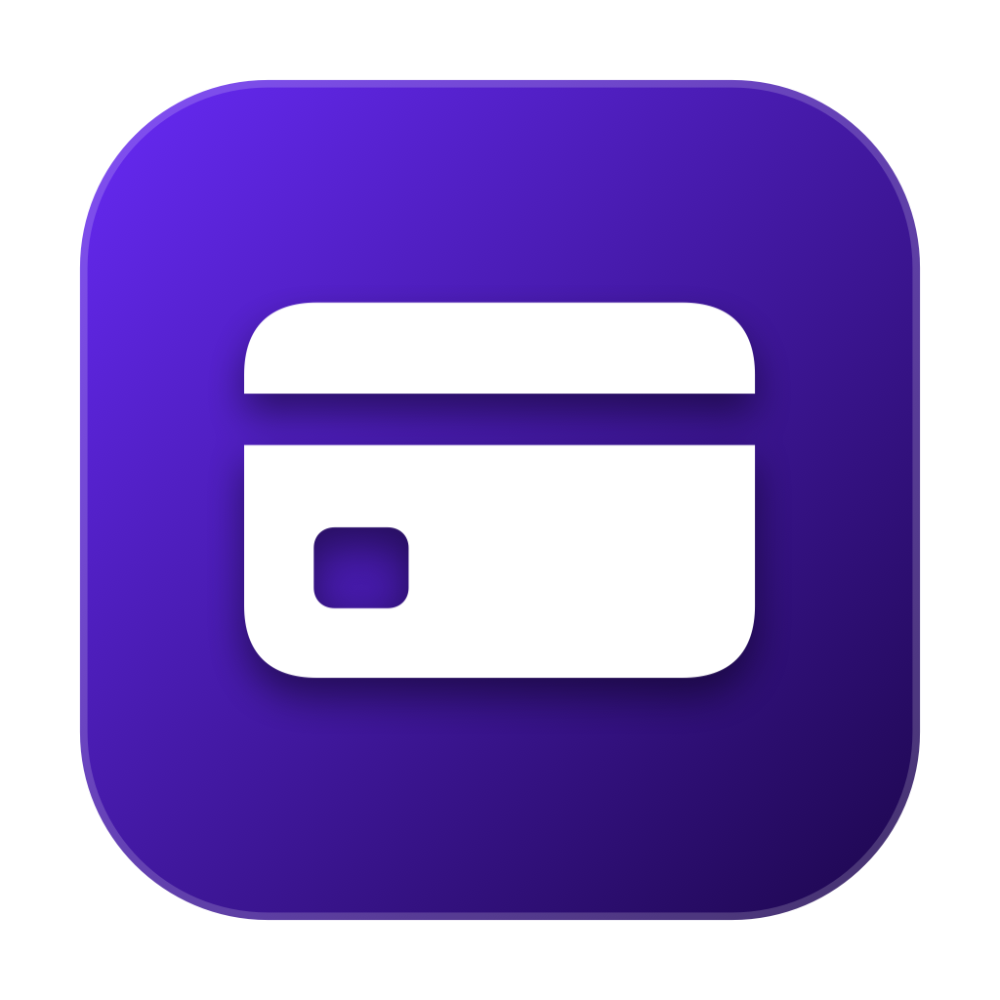

# AirCard-iOS 26.4

<p align="center">
  
</p>

<p align="center">Experimental iOS 26.4 support for changing local Apple Wallet artwork, passcode themes, and PosterBoard wallpapers without a jailbreak.</p>

<p align="center">
  <a href="README.zh-CN.md">简体中文</a> · <strong>English</strong> ·
  <a href="https://rnadow.github.io/aircard/">Project site</a> ·
  <a href="https://rnadow.top/posts/aircard-ios-26-4-windows-build/">Build notes</a>
</p>

<p align="center">
  
  
  
  
  
</p>

> [!WARNING]
> This is an experimental research build, not a promise of compatibility with every device or iOS build. Run the compatibility probe before touching Wallet. Make a backup and proceed at your own risk.

## What this fork adds

This fork keeps the upstream AirCard feature set and adds an iOS 26.4 validation and recovery path:

- an on-device compatibility probe that tests loopback, pairing, AFC, AirTraffic traversal, exact-byte readback, and cleanup without modifying Wallet;
- importing trusted pairing records in `.plist`, `.mobiledevicepairing`, or `.mobilepair` format when Developer Mode does not show an authorization prompt;
- focused-card detection for Wallets containing many cards: the card currently opened in Wallet receives a green **CURRENT CARD** badge and is the only card selected for flashing;
- local bank and last-four labels, stored on the device, so detected hashes can be recognized later;
- a Windows launcher that pushes the source, runs the macOS GitHub Actions build, downloads the unsigned IPA, and verifies its SHA-256 checksum.

The current package is **v1.3.3 (2643)**. A verified unsigned build is produced as `build/AirCard-iOS.ipa`.

## Features

### Wallet artwork

- Replaces local artwork caches for individual Apple Wallet cards.
- Supports PNG artwork and the PDF cache used by some transit cards.
- Detects card identifiers from device logs while Wallet is open.
- Supports one-card selection or batch flashing.

### Multi-card workflow

When Wallet contains many cards, a generic scan can enumerate several identifiers. Do not choose a hash only because it appeared most recently.

1. In AirCard, start the Wallet card scan.
2. Open Wallet and tap the exact card you want to customize.
3. Wait until AirCard marks one entry with the green **CURRENT CARD** badge.
4. Optionally rename it with the bank name and last four digits; the label is local only.
5. Assign the artwork and flash only that selected card.

### Passcode and wallpaper themes

- Live passcode dialer preview, framing, full-poster layout, and individual button cutouts.
- Import and export of `.passthm` themes.
- Import and injection of `.tendies` PosterBoard wallpapers.
- NeoSpring-based respring after wallpaper changes.

## Requirements

- An iPhone running the tested iOS 26.4 environment.
- A working loopback VPN such as LocalDevVPN or SideStore WireGuard.
- A trusted Remote Pairing record generated for this iPhone.
- A signing and sideloading method you control.

> [!IMPORTANT]
> A `.p12` file is a signing certificate, not a device pairing record. AirCard imports `.plist`, `.mobiledevicepairing`, or `.mobilepair` pairing files. Never publish a pairing record, certificate, UDID, card hash, or full diagnostic log.

## Pairing and first run

### Option A: pair on device

Open AirCard's **Pairing** tab, tap **Pair This iPhone**, then approve the request under **Settings → Privacy & Security → Developer Mode** if iOS shows it.

### Option B: import an existing pairing record

If iOS 26 does not display the pairing prompt, export a trusted pairing record from a Mac or an existing SideStore/iLoader setup, then use **Import Pairing Record** in AirCard. One working iLoader sequence is:

1. **Delete Stored Pairing**.
2. Reconnect the iPhone and tap **Trust** when prompted.
3. Open **Manage Pairing File** and choose **Place**.
4. Import the resulting pairing file into AirCard.

Start the loopback VPN before connecting. An error such as `failed to parse raw pairing file from bytes` usually means the wrong file type was selected or the loopback tunnel was not active.

### Run the safe probe

Before changing Wallet, run **iOS 26.4 Compatibility → Run iOS 26.4 Probe**. The probe writes a randomized canary under `/var/mobile/Library/Caches`, reads and verifies the exact bytes through AirTraffic, and removes its temporary objects. It does not write to Passbook or Wallet.

Only proceed after every probe stage is green.

## Installation

The IPA produced by this repository is unsigned. Sign and install it using SideStore, AltStore, TrollStore, LiveContainer, Xcode, or another method you control.

## Build from Windows

Windows cannot run Apple's iOS SDK locally, so the included script delegates compilation to a macOS GitHub Actions runner.

### 1. Install and authenticate GitHub CLI

```powershell
winget install --id GitHub.cli
gh auth login
```

Open a new PowerShell window if `gh` is not recognized.

### 2. Run the build

```powershell
Set-Location "C:\Projects\AirCard-iOS-26.4"
powershell -ExecutionPolicy Bypass -File .\build-from-windows.ps1 -Repository "rnadow/aircard"
```

Do not append a PowerShell backtick to the one-line command. The output is downloaded to:

```text
build/AirCard-iOS.ipa
build/AirCard-iOS.ipa.sha256
```

If Git reports `detected dubious ownership`, trust this repository only:

```powershell
git config --global --add safe.directory "H:/CWD/Documents/ChatGPT/个人/AirCard-iOS-26.4"
```

### Build on macOS

Requirements: macOS 14+, Xcode 16+, and XcodeGen.

```bash
brew install xcodegen
git clone https://github.com/rnadow/aircard.git
cd aircard
./build-ipa.sh
```

Rebuild the Rust framework only when modifying `rust-core`:

```bash
./build-ios.sh
```

## Repository layout

```text
AirCard-iOS-26.4/
├── ios-app/                 SwiftUI app
├── rust-core/               Airlift/AirTraffic Rust core
├── project.yml              XcodeGen configuration
├── build-ipa.sh             macOS IPA build
├── build-ios.sh             Rust framework build
├── build-from-windows.ps1   Windows → GitHub Actions workflow
├── build-ipa.yml            GitHub Actions workflow source
└── docs/                    GitHub Pages project site
```

## Security and limitations

- This project changes local visual cache files; it does not change payment credentials, balances, issuer data, or the Secure Element.
- Pairing records authenticate a host to a specific device. Keep them private and remove them before sharing logs or archives.
- The compatibility probe reduces risk but cannot guarantee that all flashing paths are safe on every build.
- Test one card and one disposable artwork first. Avoid batch flashing until the exact target is confirmed.

## Credits

- [@mak5er](https://github.com/mak5er) — upstream AirCard-iOS, UI, passcode theming, Tendies engine, and pairing work.
- [@merybist](https://github.com/merybist) — initial base port.
- [AirLift](https://github.com/0xjohnnydev/airlift) by [@0xjohnnydev](https://github.com/0xjohnnydev) — AirTraffic and ATAirlock research underlying `AirliftFFI`.
- [NeoSpring](https://github.com/rooootdev/neospring) — respring implementation and related research.

## License

MIT. See [LICENSE](LICENSE).
